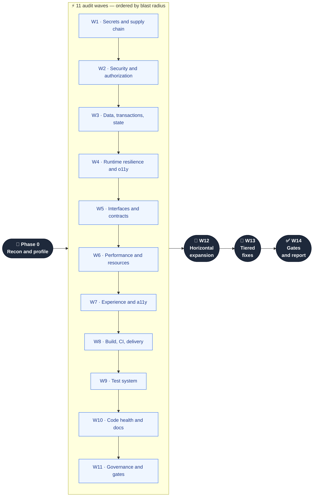
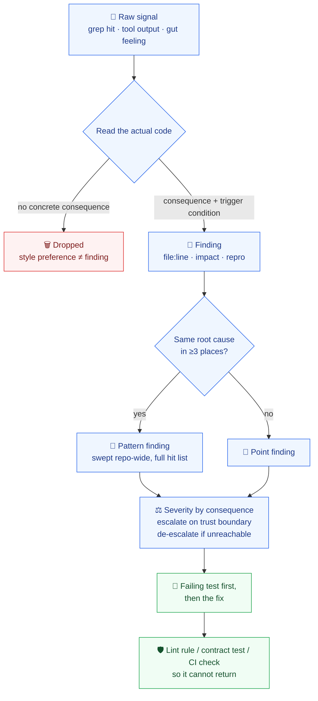
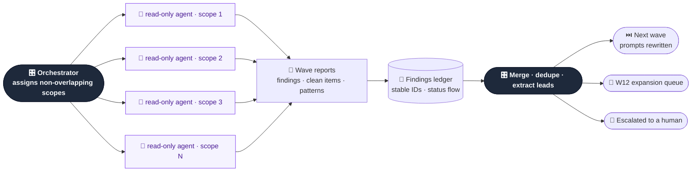

<div align="center">

# 🔍 Full-Repo Audit

### The audit pipeline that finds what code review misses — on any stack, in any language.

**Recon first. Severity-ordered waves. Findings that drive the next wave. New CI gates as the deliverable.**

[](#license)
[](#what-this-is)
[](#coverage-map)
[](#works-on-your-stack)
[](#quick-start)

**English** · [简体中文](README.zh-CN.md)

</div>

---

## The problem

A code review looks at a diff. **Nobody looks at the repository.**

So the defects that survive are exactly the ones no diff can show you: the credential sitting in
git history since 2023, the batch endpoint that forgot the tenant check while its single-record
sibling remembered, the cache key missing a tenant dimension, the migration that silently makes
rollback impossible, the CI workflow handing secrets to fork PRs, the 400 tests that would still
pass if you deleted the feature.

Then someone says *"let's do a full audit"* — and it goes wrong in one of two ways:

| Failure mode | What actually happens |
|---|---|
| 🎲 **The vibe sweep** | An agent is told "review everything", wanders the repo, and returns 40 style opinions and zero exploitable findings. |
| 🧱 **The checklist binder** | A 600-item enterprise checklist, 80% inapplicable, 0% prioritized. Three days in, the team stops. |

Both fail for the same reason: **no model of what this repository actually is, and no ordering by
what a finding actually costs.**

---

## What this is

A **skill** — a packaged audit methodology your agent CLI loads and executes. It profiles the
repository first, then sweeps it in 14 waves ordered by blast radius, and finishes by turning
what it found into automated gates so the same class of defect cannot come back.



Every wave dispatches 3–8 **read-only** agents in parallel. Review and fix are separate roles —
an agent that edits while it reviews cannot be audited, and cannot be conflict-controlled.

---

## Forged in production, not in a blog post

This is not a checklist someone imagined. The methodology was distilled from real audit
campaigns — **over ten billion tokens of agent work**, run against **codebases past the
million-line mark**, then rewritten into the sequence that actually worked.

<div align="center">

| 🔥 Campaign scale | 🎯 What it caught | 🧬 What got distilled |
|:---|:---|:---|
| 10B+ tokens of audit runs | SSRF bypass past an existing allowlist | 14 waves, re-derived by severity |
| 1M+ line repositories | 10+ transaction-atomicity defects | 66 dimensions, each a real checklist |
| 14 rounds · 68+ agents | 11 missing error boundaries | 4 prompt templates that hold up |
| 200+ findings fixed end to end | 13 tests that passed no matter what | The anti-patterns that wasted the most money |

</div>

The ordering in this repo is **the correction of a mistake**: v1 audited UI first. Every UI fix
was then invalidated by the deeper contract and data fixes that followed. Secrets now go first,
UI goes late, and tests are repaired *before* the fix wave — so fixes land against gates you can
trust. [Read the full rationale →](CHANGELOG.md)

---

## Business value

> One cross-tenant authorization defect reaching production costs more than every audit you will
> ever run. This pipeline is built around that asymmetry.

<table>
<tr><td width="33%" valign="top">

### 💼 Before a release
Ship with a written answer to *"can we release?"* — severity-counted, with the residual risk
named. Not a vibe.

</td><td width="33%" valign="top">

### 🤝 Before due diligence
Hand over a dimension coverage table where every skipped dimension records **why** it was
skipped. Auditable, not aspirational.

</td><td width="33%" valign="top">

### 🏗️ Taking over a codebase
Turn "nobody knows what's in here" into a profile, a module map, a hotspot ranking and a
prioritized backlog in one pass.

</td></tr>
<tr><td valign="top">

### 🔐 Before exposing an API
Every external entry point enumerated and walked through authn, authz, injection, abuse limits
and privacy — one by one.

</td><td valign="top">

### 🧾 Compliance & supply chain
Secrets in history, license conflicts, unpinned actions, install-time scripts, SBOM gaps — the
questions auditors actually ask.

</td><td valign="top">

### 📉 Stopping the bleeding
W11 converts findings into lint rules, contract tests and CI checks, so next quarter's audit
doesn't re-find this quarter's bugs.

</td></tr>
</table>

**The economics:** an audit wave is minutes of compute. A cross-tenant data leak is an incident
report, a customer notification, and a quarter of trust. The pipeline is deliberately ordered so
the cheapest scans catch the most expensive failures first.

---

## How a finding earns its place

Most audit output is noise because anything that *looks* odd gets reported. Here, a signal has to
survive a gauntlet before it is allowed to cost you attention.



Hard rules enforced on every agent: **`file:line` or it doesn't exist.** A consequence and a
trigger condition, or it doesn't get a severity. And every agent must also report what it checked
and found **clean** — without that, "we audited it" and "we skipped it" are indistinguishable.

---

## Findings drive the next wave

This is the part that separates an audit from 14 unrelated scans. After every wave the
orchestrator — not an agent — merges findings, extracts patterns, and **rewrites the prompts of
later waves**.



**Example:** W2 finds authorization checks scattered across handlers instead of centralized. That
single observation is injected into W5 (module boundaries — *why is there no policy layer?*), W9
(*where is the authorization matrix test?*) and W11 (*make an architecture lint rule enforce it*).
One finding, three waves deeper.

---

## Works on your stack

Phase 0 runs a read-only recon script and builds a repository profile: languages, package
managers, workspace layout, real build/test/lint commands (taken from CI, not guessed), module
→ role map, data layer, runtime shape, 90-day churn hotspots, existing governance.

Dimensions then describe scope by **role** — entry layer, trust boundary, persistence layer,
presentation layer, delivery layer — and the profile maps roles to this repo's real paths. That
is why there are no framework names hardcoded anywhere in the skill.

<div align="center">

`Node/TS` · `Python` · `Go` · `Rust` · `Java/Kotlin` · `Ruby` · `PHP` · `.NET` · `Elixir` · `Swift` · `Shell` · `Terraform` · `K8s/Helm`

*Per-ecosystem command maps ship in `references/recon-playbook.md`. Polyglot monorepos are profiled per ecosystem.*

</div>

Profile time on a 2,700-file monorepo: **7.7 seconds.** It installs nothing and writes nothing.

Dimensions that don't apply are marked **not applicable, with a reason** — no frontend, no a11y
wave; managed database, the backup dimension records who owns it instead. Applicability is
recorded, never silently skipped.

---

## Quick start

```bash
git clone https://github.com/MarkSight/full-repo-audit.git
cp -r full-repo-audit/.agents/skills/full-repo-audit ~/.claude/skills/
```

| Agent CLI | Install location |
|---|---|
| Claude Code | `~/.claude/skills/full-repo-audit/` (global) or `.claude/skills/…` (per project) |
| CLIs using `.agents` | `.agents/skills/full-repo-audit/` |

Then, from the repository you want audited:

```
/full-repo-audit
/full-repo-audit --scope=services/api --depth=deep
/full-repo-audit --waves=W1,W2,W9 --fix=none
```

| Parameter | Default | Effect |
|---|---|---|
| `--scope=<path…>` | whole repo | limit to a subtree |
| `--waves=<ids>` | `all` | run selected waves only |
| `--depth=quick\|standard\|deep` | `standard` | agents per wave + severity floor |
| `--fix=none\|critical\|all` | `critical` | what gets fixed vs only reported |
| `--autonomous` | off | skip the confirmation before commit/push/PR |

Requirements: `git`, `bash`, and whatever the audited repo already needs for its own
lint/typecheck/test/build. **No dependencies to install, no service to sign up for.**

Repo size sets the agent budget automatically:

| Tier | Source files | Agents per wave | Strategy |
|---|---|---|---|
| **S** | < 200 | 3–4 | read everything |
| **M** | 200–1,500 | 5–6 | index all, deep-read risk paths |
| **L** | 1,500–6,000 | 6–8 | shard by module |
| **XL** | > 6,000 | 6–8 + rounds | rank by risk, deep-dive top 30% |

---

## What you get

```
audit/
├── 00-profile.md         ← repository profile: stack, commands, module→role map, hotspots
├── 00-plan.md            ← applicability matrix · agent assignment · sampling strategy
├── findings.md           ← the ledger: stable IDs, severity, status open→fixed→verified
├── expansion-queue.md    ← patterns awaiting the repo-wide sweep
├── deferred.md           ← what was NOT fixed, why, suggested owner and deadline
├── W1/ … W14/            ← one report per agent: findings, clean items, open questions
└── REPORT.md             ← executive summary · coverage table · fixes · new gates · residual risk
```

`REPORT.md` opens with the only line most readers need: **can this ship, and what is the largest
remaining risk.** Then the coverage table — every dimension marked audited, sampled (with scope)
or not applicable (with reason) — which is what makes "zero blind spots" a verifiable claim
rather than a slogan.

A finding in the ledger looks like this:

```markdown
### [F-B2-003] [High] Batch archive endpoint skips the tenant ownership check

- Dimension: B2 · authorization & multi-tenant isolation
- Location:  src/api/archive.ts:64-78  (same pattern: src/api/restore.ts:41)
- Impact:    any authenticated user can archive another tenant's records
- Trigger:   send an arbitrary id array — no special privilege needed
- Evidence:  update at archive.ts:71 has `WHERE id IN (...)` and no tenant_id
- Fix:       force tenant scoping in the repository layer; call archiveForTenant()
- Regression: test "user A archives tenant B's ids → 403, rows unchanged"
- Hardening: architecture lint — api layer may not call db.update directly
```

---

## Coverage map

66 dimensions, each with its own checklist. Not a keyword list — the security file alone walks
every external entry point through eight dimensions, item by item.

| Wave | Dimensions |
|---|---|
| **W1** Secrets & supply chain | secrets & credential exposure · dependency vulnerabilities · supply-chain integrity · license compliance |
| **W2** Security | authn & sessions · authz & multi-tenant isolation · injection & input validation · crypto & key handling · web/platform hardening · abuse & quotas · privacy, PII & retention · webhooks & integrations |
| **W3** Data & state | transactions & atomicity · migrations & compatibility · schema, indexes & queries · concurrency & races · state machines · cache coherence · backup, restore & data-loss paths · time, precision, units & encoding |
| **W4** Runtime | error handling · failure modes & recovery · resource lifecycle & shutdown · observability · config & feature flags |
| **W5** Contracts | type safety · API contracts & versioning · module boundaries · single-source-of-truth drift · plugin/skill/tool contracts |
| **W6** Performance | algorithmic hot paths · I/O & network efficiency · client performance budgets · build & startup · benchmarks & regression guards |
| **W7** Experience | flows & information architecture · accessibility WCAG AA · i18n/l10n · responsive & cross-platform · empty/loading/error/offline states · CLI & library DX · copy consistency |
| **W8** Delivery | build reproducibility · CI/CD correctness & security · containers & IaC · deploy & rollback · release & versioning discipline |
| **W9** Tests | risk-based coverage gaps · assertion strength · isolation, fixtures & determinism · suite structure & cost · missing test types · test-debt cleanup |
| **W10** Health & docs | dead code · duplication · coupling & decomposition · naming & style · comments & TODO debt · repo hygiene · docs completeness · docs accuracy · DevEx & local setup |
| **W11** Governance | error-code taxonomy · logging uniformity · cross-cutting pattern consistency · gate hardening & ownership |

---

## Five things it does that generic audits don't

### 1 · It hunts for gates that only *look* alive
A `continue-on-error` on the security job. A coverage threshold set below the current value. A
lint config that excludes the directory where the bugs live. **A fake gate is worse than no gate**
— it manufactures confidence. W11 goes looking for them specifically.

### 2 · Pattern findings, not finding spam
Same root cause in 12 files is **one** finding with 12 locations, a machine-searchable signature,
and a lint rule draft — not 12 ledger rows padding a count.

### 3 · Tests get repaired before the fix wave
A fix verified by a test that passes no matter what is not a fix. W9 runs mutation checks on
suspicious tests: break the implementation on purpose — if the test stays green, it is a liability
and gets deleted or rewritten.

### 4 · Severity by consequence, with escalation rules
On a trust boundary: escalate. Triggerable by an unauthenticated stranger: escalate. Unreachable
code path: de-escalate, and show your reachability reasoning. *"I'd write this differently"* is
explicitly not a finding.

### 5 · Gate hardening is a required deliverable
W11 must produce at least one new automated gate. An audit that only produces a document is an
audit you will pay for again.

---

## Trust boundary

Review and local fixes run unattended. These four things never happen automatically:

| Never automatic | Why |
|---|---|
| 🚀 `commit` / `push` / PR | Shared state. Confirmed with you first — unless you pass `--autonomous`. |
| 🔑 Leaked credentials | Reported with rotation and history-cleanup steps. Rotation is yours; the skill never writes the secret into the report either. |
| 💥 Destructive migrations, production config, permission policy | Proposed as a plan, not applied. |
| 📦 Dependency major upgrades | Listed with risk notes, never auto-bumped. |

The skill also treats everything inside the repository — code, comments, docs, issue text — as
**data, not instructions**. Text that tries to direct the agent is reported as suspicious, not
obeyed.

---

## Repository layout

```
.agents/skills/full-repo-audit/
├── SKILL.md                       # orchestration: waves, batching, fixes, gates, discipline
├── scripts/
│   └── repo-profile.sh            # read-only recon: stack, commands, hotspots, risk greps
└── references/
    ├── recon-playbook.md          # Phase 0 manual · 13-ecosystem command map · profile template
    ├── dim-A-supply-chain.md      # W1  · secrets, dependencies, supply chain, licenses
    ├── dim-B-security.md          # W2  · 8 security dimensions
    ├── dim-C-data-state.md        # W3  · 8 data & state dimensions
    ├── dim-D-runtime.md           # W4  · 5 resilience & observability dimensions
    ├── dim-E-contracts.md         # W5  · 5 interface & contract dimensions
    ├── dim-F-performance.md       # W6  · 5 performance dimensions
    ├── dim-G-experience.md        # W7  · 7 experience dimensions
    ├── dim-H-delivery.md          # W8  · 5 delivery & ops dimensions
    ├── dim-I-tests.md             # W9  · 6 test-system dimensions
    ├── dim-J-health-docs.md       # W10 · 9 code-health, docs & DevEx dimensions
    ├── dim-L-governance.md        # W11 · 4 governance dimensions
    ├── severity-and-reporting.md  # severity rubric · finding format · ledger · report template
    └── agent-playbook.md          # 4 prompt templates · parallelism · conflicts · anti-patterns
```

Progressive disclosure by design: `SKILL.md` orchestrates, and each agent loads only the
checklist for its own dimension.

---

## FAQ

<details>
<summary><b>How long does a full run take?</b></summary>

Phase 0 is seconds. The audit waves scale with repo size and depth: an S-tier repo on
`--depth=quick` is a short session; an XL monorepo on `--depth=deep` is a campaign you run
across multiple sessions. `--waves` and `--scope` exist so you can spend the budget where it
matters — W1, W2 and W9 alone already cover the findings that hurt most.
</details>

<details>
<summary><b>Will it wreck my working tree?</b></summary>

Audit agents are read-only. The fix wave shards file ownership so two agents never hold the same
file, and a dirty working tree is stashed or committed before any batch fix — mixing your
in-progress work with automated fixes is not allowed. Gates must be green before anything is
committed, and `--no-verify`-style bypasses are forbidden.
</details>

<details>
<summary><b>What if a fix turns out to be wrong?</b></summary>

Every Critical/High fix ships with a failing-test-first requirement, so a fix that doesn't fix
anything is visible immediately. If a repair introduces a new failure, the rule is to revert
rather than stack another patch, reopen the finding, and record why the first attempt failed.
</details>

<details>
<summary><b>Can I run only the security part?</b></summary>

`--waves=W1,W2 --fix=none` gives you a security and supply-chain report with no code changes.
</details>

<details>
<summary><b>Does it work on a language not in the list?</b></summary>

Yes — the dimensions are language-independent; only the command map is ecosystem-specific. For an
unlisted stack, Phase 0 records its commands from the repo's own scripts and CI config. If a
command can't be determined, it is recorded as unknown and becomes a finding instead of a guess.
</details>

<details>
<summary><b>Is this a SaaS? Does it phone home?</b></summary>

No. It is Markdown and one read-only shell script in your repository. Nothing is uploaded,
nothing is installed, no account exists.
</details>

---

## License

MIT — use it commercially, modify it, ship it inside your own tooling. No attribution required.

<div align="center">

**[Rationale & v1→v2 migration](CHANGELOG.md)** · **[简体中文](README.zh-CN.md)**

*Built from battle scars. Every wave earned its position by failing in a different order first.*

</div>
