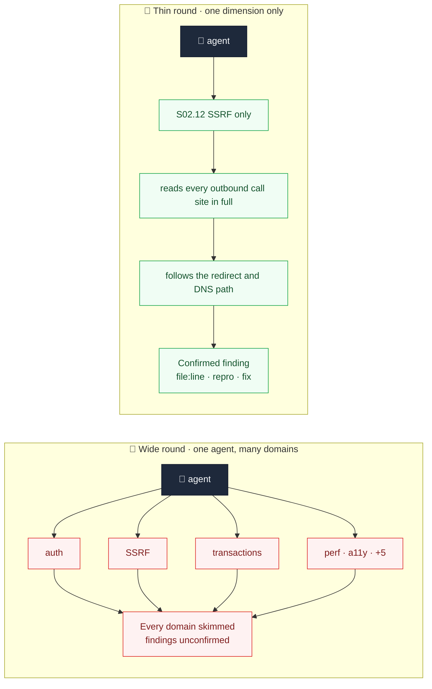
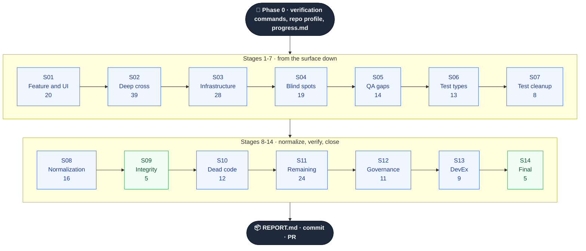
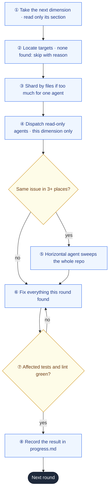

<div align="center">

# 🔍 Full-Repo Audit

### Wide coverage. Thin rounds. Every dimension gets its own round.

**223 audit dimensions, each reviewed in a dedicated round by agents that carry nothing else —
fixed and verified before the next round begins.**

[](#license)
[](#stage-map)
[](#wide-catalog-thin-rounds)
[](#works-on-any-stack)
[](#quick-start)

**English** · [简体中文](README.zh-CN.md)

</div>

---

## The problem

A code review looks at a diff. **Nobody looks at the repository.**

So the defects that survive are the ones no diff can show: the batch endpoint that forgot the tenant
check its single-record sibling remembered, the transaction whose lower layer quietly uses a global
connection, the SSRF guard that never re-validates after a redirect, the tests that still pass if you
delete the feature.

When teams finally run a "full audit", it fails in one of three ways:

| Failure mode | What actually happens |
|---|---|
| 🎲 **The vibe sweep** | One agent is told "review everything" and returns 40 style opinions, zero exploitable findings. |
| 🌊 **The breadth trap** | A long list of domains, handed out a few at a time to each agent. Every domain gets skimmed. It *looks* thorough and finds almost nothing. |
| 🧾 **Review now, fix later** | All review first, all fixes at the end. Findings pile up, fixes collide, nothing is verified in between. |

The usual response to the breadth trap is to cut the list. That trades one problem for another:
**shallow everywhere, or deep in a few places and blind everywhere else.**

---

## Wide catalog, thin rounds

Coverage and depth were never in conflict. What conflicts is **the width of a single round.**

- **Coverage** comes from the catalog: 14 stages, 223 fine-grained dimensions.
- **Depth** comes from the round: one dimension, 3–6 checkpoints, nothing else in the agent's head.
- **Round count is uncapped.** However many dimensions apply to your repository, that is how many rounds run. Dozens is normal. Two hundred is normal.



A dimension is sized so one agent can hold all of it in mind at once. "Security" is not a dimension.
"Injection" is not a dimension. **"SSRF and outbound requests"** is — five checkpoints, one mental model,
one round.

---

## Forged in production — including the failures

The method was distilled from real audit campaigns: **over ten billion tokens of agent work**, run
against **codebases past the million-line mark**.

<div align="center">

| 🔥 Campaign scale | 🎯 What it caught |
|:---|:---|
| 10B+ tokens of audit runs | SSRF bypass past an existing allowlist |
| 1M+ line repositories | 10+ transaction-atomicity defects |
| 14 rounds · 68+ agents | 11 missing error boundaries |
| 200+ findings fixed end to end | 13 tests that passed no matter what |

</div>

Both extremes were run on real repositories before this design existed:

| Version | Shape | Result |
|---|---|---|
| **v1** | 14 focused rounds, fixes inside each round | Worked well. Coverage capped by 14 rounds. |
| **v2** | 66 dimensions packed into 11 wide waves, fixes deferred to the end | Markedly worse. Attention spread thin; effectively one giant round. Rolled back. |
| **v3** | v2's breadth, v1's thinness — 223 dimensions, **one per round**, fixes inside each round | This repository. |

[Read what went wrong and why →](CHANGELOG.md)

---

## Five rules

Break any one of them and the campaign collapses back into a shallow sweep.

1. **One round = one dimension.** Never merge dimensions into a round, even related ones.
2. **Rounds run strictly in series.** A round is not opened until the previous one is fixed, verified and recorded.
3. **Agents carry only the current dimension.** When a round needs several agents, they shard by *files* — never by topic.
4. **Fixes never pile up.** What a round finds, that round fixes.
5. **To go faster, choose fewer — never go wider.** Run selected stages or dimensions. Never merge dimensions to cut the round count.

---

## How it runs



Each stage then expands into serial rounds, one per dimension. S02 alone is 39 rounds: `S02.01 auth coverage → S02.02 session lifecycle → … → S02.12 SSRF → … → S02.39 bundle size`.

The stage order comes straight from the production campaign, because stages feed each other: S05
re-checks S01–S04's fixes, S07 cleans up the tests S06 diagnosed, S09 verifies everything before S10
starts deleting code, S12 turns every earlier stage's hot patterns into gates.

Every round runs the same closed loop:



At the end of every stage: **full lint, typecheck, test and build**, plus a stage summary of at most
30 lines whose hot patterns are written into the prompts of related dimensions in later stages.

---

## Stage map

| Stage | Theme | Dimensions | A few of its rounds |
|---|---|:---:|---|
| **S01** | Feature and interaction layer | 20 (+8 no-UI) | primary action paths · forms · destructive-action safety · drag and drop · streaming UI · realtime reliability · upload flow |
| **S02** | Deep cross review | 39 | auth coverage · session lifecycle · IDOR · multi-tenant isolation · SQL injection · SSRF · XSS · transaction boundaries · TOCTOU · idempotency · silent error swallowing · timeouts · N+1 |
| **S03** | Infrastructure | 28 | type escape hatches · unvalidated boundary data · schema drift · fake CI gates · CI secrets exposure · migration reversibility · stuck states · API versioning · Dockerfile · IaC |
| **S04** | Blind-spot sweep | 19 | workspace secrets · git-history secrets · keys in client bundles · default-secret fallbacks · README executability · repo residue |
| **S05** | QA gap check | 14 | fix-induced signature changes · user journeys (one round each) · fault injection · TODO triage · audit events · alerting |
| **S06** | Test-type deep dive | 13 | weak assertions · mutation spot checks · mock leakage · flaky factors · authorization-matrix tests |
| **S07** | Test cleanup | 8 | text-scanner test migration · hardcoded-count tests · leaked `only` · oversized snapshots |
| **S08** | Normalization | 16 | file naming · error-handling style · `??` vs `\|\|` · suppression comments · cross-package signatures |
| **S09** | Integrity check | 5 | full typecheck · lint · test · build · cross-stage conflict detection |
| **S10** | Dead code and decoupling | 12 | unused exports · duplicated permission logic · over-abstraction · splitting large files by responsibility |
| **S11** | Remaining blind spots | 24 | dependency vulnerabilities · supply chain · PII in logs · graceful shutdown · rate limits · ReDoS · backups · timezones · money precision · encoding |
| **S12** | Cross-cutting governance | 11 | error-code taxonomy · log format · outbound call wrappers · hot patterns turned into gates · dead gates |
| **S13** | Developer experience | 9 | CLI help and exit codes · script robustness · from-scratch setup test |
| **S14** | Final validation | 5 | full-chain regression · fixed-item regression check · report and PR |

Dimensions that don't apply — no UI, no database, no containers — are marked skipped with a reason in
`progress.md` during Phase 0. A small library might run 60 rounds; a large product monorepo, 200+.

---

## Built for campaigns that outlive a session

Two hundred rounds will not fit in one context window, so the skill is designed to be resumed.

```markdown
# Audit progress (start commit: abc1234)

## S02 Deep cross review
- [x] S02.05 IDOR and resource ownership — High 2 / Medium 1, 3 fixed
- [-] S02.23 Keyboard access and focus — no UI
- [ ] S02.12 SSRF and outbound requests
```

`audit/progress.md` is the only state. To continue — after a context compaction, a new session, or a
week off — read it and the latest stage summary, then start from the first `[ ]`. Nothing already
`[x]` is re-run.

---

## Business value

> One cross-tenant authorization defect reaching production costs more than every audit you will
> ever run.

<table>
<tr><td width="33%" valign="top">

### 💼 Before a release
A written answer to *"can we ship?"* — every dimension reviewed or skipped with a reason, every
unfixed item listed with its cause.

</td><td width="33%" valign="top">

### 🤝 Before due diligence
A progress file that shows, dimension by dimension, what was examined, what was found, and what
was verified green.

</td><td width="33%" valign="top">

### 🏗️ Taking over a codebase
From "nobody knows what's in here" to a repository read, fixed and re-verified one dimension at a
time.

</td></tr>
<tr><td valign="top">

### 🔐 Before exposing an API
Seventeen separate security rounds — auth coverage, sessions, IDOR, tenancy, each injection class,
SSRF, CSRF, crypto, webhooks.

</td><td valign="top">

### 🧾 Compliance and supply chain
Secrets in git history, license conflicts, unpinned CI actions, install-time scripts, PII in logs,
data deletion paths.

</td><td valign="top">

### 📉 Stopping the bleeding
S12 turns every stage's hot patterns into lint rules, tests and CI checks — and hunts gates that
only look alive.

</td></tr>
</table>

---

## Works on any stack

No dimension names a framework. Each has a **Locate** line that says *what* to look for — "every query
that reads a resource by ID", "every outbound HTTP call" — and the round finds *where* in your
repository using a read-only profile and search.

<div align="center">

`Node/TS` · `Python` · `Go` · `Rust` · `Java/Kotlin` · `Ruby` · `PHP` · `.NET` · `Elixir` · `Swift` · `Terraform`

</div>

Verification commands are read from your CI config first, then your task runner, then ecosystem
defaults. A gate that can't be found is recorded as missing — never invented. The profile script takes
**under 8 seconds** on a 2,700-file monorepo, installs nothing and writes nothing.

---

## Quick start

```bash
git clone https://github.com/MarkSight/full-repo-audit.git
cp -r full-repo-audit/.agents/skills/full-repo-audit ~/.claude/skills/
```

| Agent CLI | Install location |
|---|---|
| Claude Code | `~/.claude/skills/full-repo-audit/` (global) or `.claude/skills/…` (per project) |
| CLIs using `.agents` | `.agents/skills/full-repo-audit/` |

From the repository you want audited:

```
/full-repo-audit                  # every applicable dimension, all 14 stages
/full-repo-audit S02 S11          # selected stages
/full-repo-audit S02.12 S11.17    # selected dimensions
```

Requirements: `git`, `bash`, and whatever your repository already needs to lint, typecheck, test and
build. **No dependencies. No service. No account.**

---

## What you get

```
audit/
├── profile.md          ← repository profile: structure, entry points, data layer, tests, hotspots
├── progress.md         ← every dimension: done, skipped with reason, or pending — the resume point
├── S01-summary.md      ← per stage: findings and fixes by dimension, unfixed items with reasons,
├── …                      hot patterns carried forward, full-gate results
├── S14-summary.md
└── REPORT.md           ← all stages merged · unfixed list · new gates · items needing a human
```

Every finding carries a location and a way to reproduce it:

```markdown
## [High] Batch archive endpoint skips the tenant ownership check
**File:** `src/api/archive.ts:71`
**Problem:** the update filters on `id IN (...)` only — any signed-in user can archive another tenant's records
**Repro:** call the batch endpoint with ids belonging to a different tenant
**Fix:** scope the update by the session tenant, as the single-record endpoint already does
```

---

## Trust boundary

Review, fixes and verification run unattended. Three things are never done automatically:

| Never automatic | What happens instead |
|---|---|
| 🔑 Real leaked credentials | Location and rotation steps reported; the secret value never enters the report |
| 💥 Migrations that delete or rewrite production data | A plan is proposed, not executed |
| 📦 Major dependency upgrades | Listed with risks, not bumped |

No gate may be turned green by skipping tests, loosening config, or `--no-verify`.

---

## Repository layout

```
.agents/skills/full-repo-audit/
├── SKILL.md                                 # five rules · round loop · stage wrap-up · resume · prompts
├── scripts/
│   └── repo-profile.sh                      # read-only repository profile
└── references/stages/
    ├── S01-feature-ui.md                    # each file: one stage's dimensions,
    ├── S02-deep-cross.md                    # each dimension: Locate + 3–6 checkpoints
    ├── …
    └── S14-final-validation.md
```

The orchestrator reads **only the current dimension's section** of a stage file, so nothing from other
dimensions competes for the agent's attention.

---

## FAQ

<details>
<summary><b>Isn't 200 rounds wasteful? Why not merge related dimensions?</b></summary>

Merging is exactly what v2 did, and it performed markedly worse. A round on a dimension with no issues
is cheap — the agent confirms and moves on. A round that merges five dimensions is expensive *and*
shallow. Thin rounds cost more wall-clock time; wide rounds cost findings.
</details>

<details>
<summary><b>Can rounds run in parallel?</b></summary>

No. Round N's fixes change the code round N+1 reads, and later stages depend on earlier ones. Inside a
single round, multiple agents may run in parallel — but only as file shards of the same dimension.
</details>

<details>
<summary><b>How long does a full campaign take?</b></summary>

Long, by design. Expect it to span several sessions; `progress.md` is the handoff. For something
quicker, pick stages or dimensions — `/full-repo-audit S02 S04 S11` covers most security and supply-chain
risk — rather than making rounds wider.
</details>

<details>
<summary><b>Will it mix its fixes into my uncommitted work?</b></summary>

No. Uncommitted changes are stashed or committed in Phase 0 and the starting commit is recorded, so
every change the audit makes can be diffed.
</details>

<details>
<summary><b>Is this a SaaS? Does it phone home?</b></summary>

No. It is Markdown and one read-only shell script living in your repository.
</details>

---

## License

MIT — use it commercially, modify it, ship it inside your own tooling. No attribution required.

<div align="center">

**[Changelog and lessons learned](CHANGELOG.md)** · **[简体中文](README.zh-CN.md)**

*Cover everything. Look at one thing at a time.*

</div>
