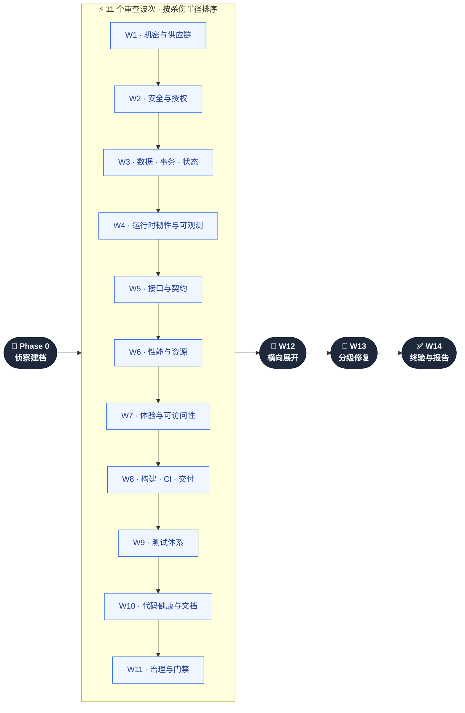
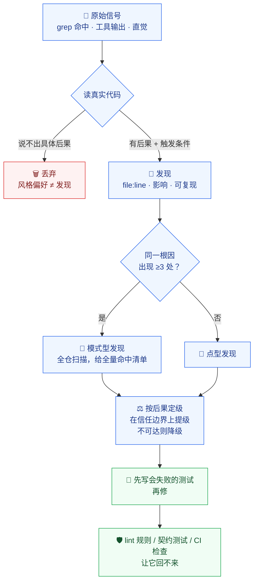
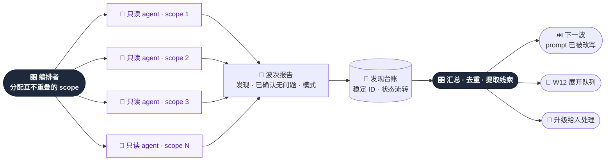

<div align="center">

# 🔍 Full-Repo Audit

### 代码评审看不见的东西，它负责看见 —— 任何技术栈、任何语言。

**先侦察画像，按杀伤半径排波，发现驱动下一波，最终交付新的质量门禁。**

[](#许可证)
[](#它是什么)
[](#覆盖地图)
[](#在你的技术栈上可用)
[](#快速开始)

[English](README.md) · **简体中文**

</div>

---

## 问题在哪

代码评审看的是 diff。**没有人看仓库。**

所以活下来的恰好是 diff 永远照不到的那些缺陷：2023 年就躺在 git 历史里的凭据；
单条接口记得校验租户、批量接口忘了的那个 handler；少了租户维度的缓存键；
让回滚从此失效却没人察觉的那次迁移；把 secrets 交给 fork PR 的 CI 配置；
以及那 400 个把功能整个删掉也依然全绿的测试。

然后有人说「做一次全面审查吧」—— 通常以两种方式失败：

| 失败模式 | 实际发生的事 |
|---|---|
| 🎲 **凭感觉扫一遍** | 让 agent「审查一切」，它在仓库里游荡一圈，交回 40 条风格意见、0 条可利用缺陷。 |
| 🧱 **企业级清单装订本** | 600 项检查表，80% 不适用、0% 排过优先级。第三天，团队放弃。 |

两者失败的原因是同一个：**没有关于「这个仓库究竟是什么」的模型，也没有按「一条发现实际值多少钱」排序。**

---

## 它是什么

一个 **skill** —— 一套打包好的审查方法论，由你的 agent CLI 加载并执行。
它先给仓库建画像，再按杀伤半径分 14 个波次扫描，最后把发现转化成自动化门禁，
让同一类缺陷无法回来。



每个波次并行派遣 3–8 个**只读** agent。审查与修复是分离的角色 ——
边审边改的 agent 既无法被复核，也无法做冲突控制。

---

## 从实战里烧出来的，不是从博客里抄来的

这不是谁凭想象列的清单。方法论提炼自真实的审查战役 ——
**超过百亿级 token 的 agent 工作量**，跑在**百万行量级的代码仓库**上，
再被重写成真正奏效的那个顺序。

<div align="center">

| 🔥 战役规模 | 🎯 抓到了什么 | 🧬 沉淀下什么 |
|:---|:---|:---|
| 百亿级 token 的审查运行 | 绕过既有白名单的 SSRF | 14 个波次，按严重度重新推导 |
| 百万行级仓库 | 10+ 处事务原子性缺陷 | 66 个维度，每个都是真清单 |
| 14 轮 · 68+ agent | 11 个缺失的错误边界 | 4 个经得起用的 prompt 模板 |
| 200+ 条发现端到端修完 | 13 个「怎么改都绿」的测试 | 最烧钱的那些反模式 |

</div>

这个仓库里的排序，**本身就是一次纠错**：v1 把 UI 放在第一波审。
结果每一条 UI 修复，随后都被更底层的契约与数据修复推翻了。
现在机密排第一，UI 后置，测试在修复波**之前**修好 ——
这样修复才落在可信的门禁上。[完整理由 →](CHANGELOG.md)

---

## 商业价值

> 一条跨租户越权缺陷流到生产，代价超过你这辈子要跑的全部审查成本。
> 这条流水线就是围绕这个不对称性设计的。

<table>
<tr><td width="33%" valign="top">

### 💼 发布前
交付一个有书面答案的「能不能发」—— 按严重度计数，残余风险被点名。
不是凭感觉。

</td><td width="33%" valign="top">

### 🤝 尽调与交付验收
交出一张维度覆盖表，每一个跳过的维度都写着**为什么**跳过。
可复核，而非自我宣称。

</td><td width="33%" valign="top">

### 🏗️ 接手陌生代码库
把「没人知道这里面有什么」变成画像、模块图、热点排序和排好优先级的待办 —— 一轮之内。

</td></tr>
<tr><td valign="top">

### 🔐 开放 API 之前
枚举每一个外部入口，逐个走完认证、授权、注入、滥用配额、隐私 —— 一条不落。

</td><td valign="top">

### 🧾 合规与供应链
历史里的机密、许可证冲突、未钉死的 action、安装期脚本、SBOM 缺口 ——
审计师真正会问的那些问题。

</td><td valign="top">

### 📉 止血
W11 把发现转成 lint 规则、契约测试和 CI 检查，
让下个季度的审查不必重查这个季度的 bug。

</td></tr>
</table>

**账是这么算的**：一个审查波次是几分钟算力；一次跨租户数据泄露是一份事故报告、
一轮客户通知、和一个季度的信任。流水线刻意把最便宜的扫描排在最前，
让它们先抓住最贵的失败。

---

## 一条发现凭什么占用你的注意力

多数审查产出是噪音，因为「看起来怪」就被报上来了。
在这里，一个信号必须先过一道关卡，才被允许消耗你的注意力。



对每个 agent 强制的硬规则：**没有 `file:line` 就等于不存在**；
说不出后果与触发条件就不给定级。而且每个 agent 还必须报告
自己检查过、**确认没问题**的项 —— 没有这一项，「审过了」和「跳过了」无法区分。

---

## 发现驱动下一波

这才是「一次审查」与「14 次互不相关的扫描」的分界线。
每波结束后，由**编排者**（不是 agent）汇总发现、提取模式，并**改写后续波次的 prompt**。



**举个例子**：W2 发现授权判断散落在各个 handler 而非集中在一层。
这一条观察会被注入 W5（模块边界 —— *为什么没有策略层？*）、
W9（*授权矩阵测试在哪？*）和 W11（*用架构 lint 规则把它锁住*）。
一条发现，往下穿透三个波次。

---

## 在你的技术栈上可用

Phase 0 跑一个只读侦察脚本，建立仓库画像：语言构成、包管理器、工作区布局、
**真实可用**的构建/测试/lint 命令（从 CI 里读，不靠猜）、模块→角色映射、
数据层、运行形态、90 天变更热点、既有治理现状。

维度随后用**角色**描述范围 —— 入口层、信任边界、持久层、表现层、交付层 ——
由画像把角色映射到这个仓库的真实路径。这就是为什么 skill 里任何地方都没有写死框架名。

<div align="center">

`Node/TS` · `Python` · `Go` · `Rust` · `Java/Kotlin` · `Ruby` · `PHP` · `.NET` · `Elixir` · `Swift` · `Shell` · `Terraform` · `K8s/Helm`

*各生态的命令映射表在 `references/recon-playbook.md`。多语言 monorepo 按生态分别建档。*

</div>

在 2700 文件的 monorepo 上建档耗时：**7.7 秒**。不安装任何东西，不写任何文件。

不适用的维度会被标成**不适用并写明原因** —— 没有前端就不跑 a11y 波次；
托管数据库则在备份维度记录「由供应商负责」。适用性被记录，而不是被静默跳过。

---

## 快速开始

```bash
git clone https://github.com/MarkSight/full-repo-audit.git
cp -r full-repo-audit/.agents/skills/full-repo-audit ~/.claude/skills/
```

| Agent CLI | 安装位置 |
|---|---|
| Claude Code | `~/.claude/skills/full-repo-audit/`（全局）或 `.claude/skills/…`（按项目） |
| 使用 `.agents` 的 CLI | `.agents/skills/full-repo-audit/` |

然后在要被审查的仓库里：

```
/full-repo-audit
/full-repo-audit --scope=services/api --depth=deep
/full-repo-audit --waves=W1,W2,W9 --fix=none
```

| 参数 | 默认 | 作用 |
|---|---|---|
| `--scope=<path…>` | 全仓 | 限定审查子树 |
| `--waves=<ids>` | `all` | 只跑指定波次 |
| `--depth=quick\|standard\|deep` | `standard` | 每波 agent 数 + 严重度下限 |
| `--fix=none\|critical\|all` | `critical` | 哪些修、哪些只报告 |
| `--autonomous` | 关 | 跳过 commit/push/PR 前的确认 |

依赖：`git`、`bash`，以及被审仓库本来就需要的 lint/typecheck/test/build。
**无需安装任何依赖，无需注册任何服务。**

仓库规模自动决定 agent 预算：

| 档位 | 源码文件数 | 每波 agent | 策略 |
|---|---|---|---|
| **S** | < 200 | 3–4 | 全量精读 |
| **M** | 200–1,500 | 5–6 | 全量索引 + 风险路径精读 |
| **L** | 1,500–6,000 | 6–8 | 按模块分片 |
| **XL** | > 6,000 | 6–8 + 分轮 | 按风险排序，只深挖 top 30% |

---

## 你会得到什么

```
audit/
├── 00-profile.md         ← 仓库画像：技术栈、命令、模块→角色映射、热点
├── 00-plan.md            ← 适用性矩阵 · agent 分配 · 抽样策略
├── findings.md           ← 发现台账：稳定 ID、严重度、状态 open→fixed→verified
├── expansion-queue.md    ← 等待全仓展开的模式
├── deferred.md           ← 没修的、为什么没修、建议 owner 与期限
├── W1/ … W14/            ← 每个 agent 一份报告：发现、已确认无问题、未决问题
└── REPORT.md             ← 执行摘要 · 覆盖表 · 已修清单 · 新增门禁 · 残余风险
```

`REPORT.md` 的开头就是多数读者唯一需要的那一行：
**这个东西现在能不能发，最大的残余风险是什么。**
紧接着是覆盖表 —— 每个维度标注已审、抽样（带范围）或不适用（带原因）——
这正是让「零盲区」成为**可验证声明**而不是口号的东西。

台账里的一条发现长这样：

```markdown
### [F-B2-003] [High] 批量归档接口缺少租户归属校验

- 维度：B2 · 授权与多租户隔离
- 位置：src/api/archive.ts:64-78（同类：src/api/restore.ts:41）
- 后果：任意已登录用户可归档其他租户的记录
- 触发：构造任意 ID 数组调用，无需特殊权限
- 证据：archive.ts:71 的 update 只有 `WHERE id IN (...)`，没有 tenant_id
- 建议：在仓储层强制注入租户条件；改调 archiveForTenant()
- 回归保护：测试「用户 A 传入 B 租户 ID → 403 且数据未变」
- 固化：架构 lint 禁止 api 层直接调用 db.update
```

---

## 覆盖地图

66 个维度，每个都有自己的检查清单。不是关键词列表 ——
仅安全那一份，就会把每个外部入口逐条走完 8 个维度。

| 波次 | 维度 |
|---|---|
| **W1** 机密与供应链 | 机密与凭据暴露 · 依赖漏洞 · 供应链完整性 · 许可证合规 |
| **W2** 安全 | 认证与会话 · 授权与多租户隔离 · 注入与输入校验 · 密码学与密钥 · Web/平台加固 · 滥用与配额 · 隐私 PII 与留存 · Webhook 与集成 |
| **W3** 数据与状态 | 事务与原子性 · 迁移与兼容 · schema 索引与查询 · 并发与竞态 · 状态机 · 缓存一致性 · 备份恢复与数据丢失 · 时间精度单位编码 |
| **W4** 运行时 | 错误处理 · 失败模式与恢复 · 资源生命周期与关停 · 可观测性 · 配置与特性开关 |
| **W5** 契约 | 类型安全 · API 契约与版本化 · 模块边界 · 单一事实源漂移 · 插件/技能/工具契约 |
| **W6** 性能 | 算法热点 · I/O 与网络效率 · 客户端性能预算 · 构建与启动 · 基准与回归守卫 |
| **W7** 体验 | 流程与信息架构 · 可访问性 WCAG AA · i18n/l10n · 响应式与跨端 · 空/载/错/离线态 · CLI 与库 DX · 文案一致性 |
| **W8** 交付 | 构建可复现 · CI/CD 正确性与安全 · 容器与 IaC · 部署与回滚 · 发布与版本纪律 |
| **W9** 测试 | 风险导向覆盖缺口 · 断言强度 · 隔离夹具与确定性 · 套件结构与成本 · 缺失测试类型 · 测试债清理 |
| **W10** 健康与文档 | 死代码 · 重复 · 耦合与拆分 · 命名与风格 · 注释与 TODO 债 · 仓库卫生 · 文档完备 · 文档准确 · DevEx 与本地环境 |
| **W11** 治理 | 错误码分类学 · 日志格式统一 · 跨切面模式一致性 · 门禁固化与归属 |

---

## 五件普通审查不会做的事

### 1 · 专门去抓「看起来活着」的假门禁
安全 job 上的 `continue-on-error`；阈值设得低于当前值的覆盖率门槛；
恰好排除了 bug 所在目录的 lint 配置。**假门禁比没有门禁更危险** ——
它在制造信心。W11 专门去找它们。

### 2 · 模式型发现，而不是发现刷量
同一根因出现在 12 个文件里，是**一条**发现带 12 个位置、
一个机器可搜索的特征、和一份 lint 规则草案 —— 不是 12 行台账去凑数字。

### 3 · 测试先于修复波被修好
被一个「怎么改都绿」的测试验证过的修复，不算修复。
W9 对可疑测试做变异验证：故意改坏实现 —— 测试仍然绿，它就是负资产，删掉或重写。

### 4 · 按后果定级，并有提降级规则
在信任边界上：提级。未认证的陌生人就能触发：提级。
代码路径不可达：降级，并给出可达性判断依据。
*「我会写成另一个样子」* 被明确规定为不是发现。

### 5 · 门禁固化是必交付项
W11 必须产出至少一条新增自动化门禁。
只产出一份文档的审查，是一份你将来要再付一次钱的审查。

---

## 人工把关边界

审查与本地修复可无人干预。下面四件事永远不会自动发生：

| 永不自动 | 理由 |
|---|---|
| 🚀 `commit` / `push` / PR | 共享状态，先跟你确认 —— 除非你传 `--autonomous`。 |
| 🔑 机密泄露 | 报告轮换与历史清理步骤。轮换是你的事；报告里也不会写入凭据本身。 |
| 💥 破坏性迁移、生产配置、权限策略 | 出方案，不落地。 |
| 📦 依赖大版本升级 | 列清单带风险说明，绝不自动升。 |

skill 还把仓库里的一切 —— 代码、注释、文档、issue 文本 —— 当作**数据而非指令**。
试图指挥 agent 的文本会被作为可疑内容报告，而不是被执行。

---

## 仓库结构

```
.agents/skills/full-repo-audit/
├── SKILL.md                       # 编排：波次、分批、修复、门禁、执行纪律
├── scripts/
│   └── repo-profile.sh            # 只读侦察：技术栈、命令、热点、风险面 grep
└── references/
    ├── recon-playbook.md          # Phase 0 手册 · 13 个生态命令映射 · 画像模板
    ├── dim-A-supply-chain.md      # W1  · 机密、依赖、供应链、许可证
    ├── dim-B-security.md          # W2  · 8 个安全维度
    ├── dim-C-data-state.md        # W3  · 8 个数据与状态维度
    ├── dim-D-runtime.md           # W4  · 5 个韧性与可观测维度
    ├── dim-E-contracts.md         # W5  · 5 个接口与契约维度
    ├── dim-F-performance.md       # W6  · 5 个性能维度
    ├── dim-G-experience.md        # W7  · 7 个体验维度
    ├── dim-H-delivery.md          # W8  · 5 个交付与运维维度
    ├── dim-I-tests.md             # W9  · 6 个测试体系维度
    ├── dim-J-health-docs.md       # W10 · 9 个代码健康、文档与 DevEx 维度
    ├── dim-L-governance.md        # W11 · 4 个治理维度
    ├── severity-and-reporting.md  # 严重度标准 · 发现格式 · 台账 · 报告模板
    └── agent-playbook.md          # 4 个 prompt 模板 · 并行 · 冲突 · 反模式
```

刻意做成渐进式披露：`SKILL.md` 只负责编排，每个 agent 只加载自己维度的清单。

---

## 常见问题

<details>
<summary><b>跑一轮要多久？</b></summary>

Phase 0 是秒级。审查波次随仓库规模与 depth 变化：S 档仓库 `--depth=quick` 是一次短会话；
XL monorepo `--depth=deep` 是要跨多次会话的战役。
`--waves` 与 `--scope` 的存在就是让你把预算花在要紧处 ——
单跑 W1、W2、W9 已经覆盖了最疼的那些发现。
</details>

<details>
<summary><b>会不会把我的工作区搞坏？</b></summary>

审查 agent 只读。修复波按文件所有权分片，两个 agent 不会同时持有同一文件；
批量修复前脏工作区会先 stash 或提交 —— 把你在做的改动和自动修复混在一起是不允许的。
任何提交前门禁必须全绿，且禁止用 `--no-verify` 之类的方式绕过。
</details>

<details>
<summary><b>万一某个修复是错的？</b></summary>

每条 Critical/High 修复都要求「先写会失败的测试」，所以没修到东西的修复会立刻暴露。
如果修复引入了新的失败，规则是回退而不是再叠一层补丁，
重新打开该发现，并记录第一次尝试为何失败。
</details>

<details>
<summary><b>可以只跑安全部分吗？</b></summary>

`--waves=W1,W2 --fix=none` 给你一份安全与供应链报告，不改任何代码。
</details>

<details>
<summary><b>清单里没有的语言能用吗？</b></summary>

能 —— 维度本身与语言无关，只有命令映射是生态相关的。
对未列出的技术栈，Phase 0 从仓库自己的脚本与 CI 配置里读出命令。
读不出来就记为「未知」，并作为一条发现处理，而不是编一条跑不通的命令。
</details>

<details>
<summary><b>这是 SaaS 吗？会回传数据吗？</b></summary>

不是。它就是你仓库里的若干 Markdown 和一个只读 shell 脚本。
不上传、不安装、没有账号。
</details>

---

## 许可证

MIT —— 可商用、可修改、可内嵌进你自己的工具链。无需署名。

<div align="center">

**[设计理由与 v1→v2 迁移](CHANGELOG.md)** · **[English](README.md)**

*来自实战的伤疤。每个波次的位置，都是先按错误顺序失败过一次才挣来的。*

</div>
