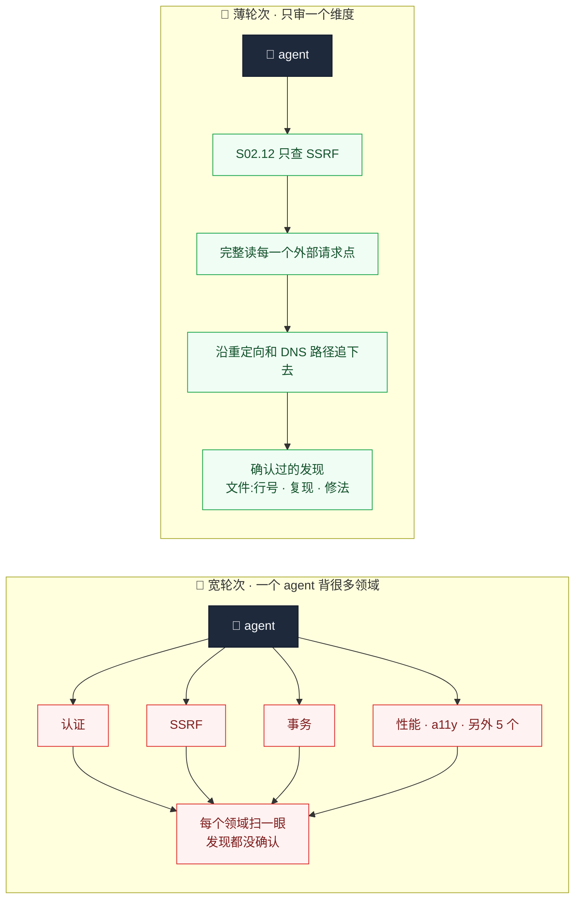
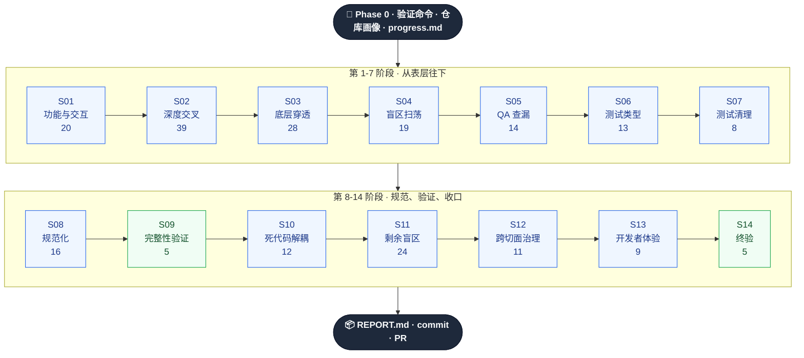
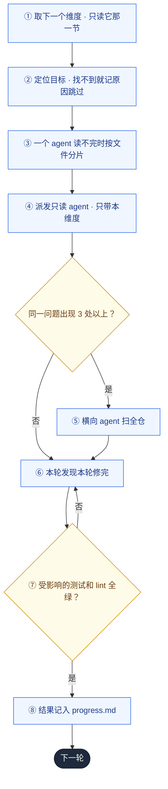

<div align="center">

# 🔍 Full-Repo Audit

### 覆盖要宽，每轮要薄。每个维度，独占一轮。

**223 个审查维度，每个维度一轮，agent 脑子里只装这一件事 —— 修完、验证完，才开下一轮。**

[](#许可证)
[](#阶段地图)
[](#维度摊开每轮摊薄)
[](#任何技术栈可用)
[](#快速开始)

[English](README.md) · **简体中文**

</div>

---

## 问题在哪

代码评审看的是 diff。**没有人看仓库。**

所以活下来的，恰好是 diff 永远照不到的缺陷：单条接口记得校验租户、批量接口忘了；
事务写得好好的，下层却偷偷用了全局连接；SSRF 防护从不在重定向之后重新校验；
以及把功能整个删掉也依然全绿的测试。

团队终于决定做一次「全面审查」时，通常以三种方式失败：

| 失败模式 | 实际发生的事 |
|---|---|
| 🎲 **凭感觉扫一遍** | 让一个 agent「审查一切」，交回 40 条风格意见、0 条可利用缺陷。 |
| 🌊 **铺得太宽** | 一长串领域清单，每个 agent 分几个。每个领域都只扫了一眼。看起来很全面，几乎什么都没查到。 |
| 🧾 **先全审、最后再修** | 审查全部做完才开始修。问题越堆越多，修复互相冲突，中间没有任何验证。 |

对「铺得太宽」的常见反应是砍清单。但这只是换了个问题：
**要么处处都浅，要么少数地方深、其余地方全盲。**

---

## 维度摊开，每轮摊薄

覆盖面和审查深度从来不矛盾。真正矛盾的是**单独一轮的宽度**。

- **覆盖面**来自目录：14 个阶段，223 个细分维度。
- **深度**来自轮次：一轮一个维度，3–6 个检查点，agent 脑子里没有别的东西。
- **轮数不设上限。** 你的仓库适用多少个维度，就跑多少轮。几十轮正常，两百轮也正常。



维度的粒度，以「一个 agent 能同时把它全部装在脑子里」为准。「安全」不是一个维度，
「注入」也不是。**「SSRF 与外部请求」**才是 —— 五个检查点，一个心智模型，一轮。

---

## 从实战里烧出来的 —— 包括失败

方法提炼自真实的审查战役：**超过百亿级 token 的 agent 工作量**，跑在**百万行量级的代码仓库**上。

<div align="center">

| 🔥 战役规模 | 🎯 抓到了什么 |
|:---|:---|
| 百亿级 token 的审查运行 | 绕过既有白名单的 SSRF |
| 百万行级仓库 | 10+ 处事务原子性缺陷 |
| 14 轮 · 68+ agent | 11 个缺失的错误边界 |
| 200+ 条发现端到端修完 | 13 个「怎么改都绿」的测试 |

</div>

在这个设计出现之前，两个极端都在真实仓库上跑过：

| 版本 | 形态 | 结果 |
|---|---|---|
| **v1** | 14 轮聚焦审查，每轮内修复 | 效果好。覆盖面被 14 轮封顶。 |
| **v2** | 66 个维度塞进 11 个宽波次，修复推到最后 | 明显更差。注意力被摊薄，事实上变成了一个巨大的轮次。已回滚。 |
| **v3** | v2 的广度 + v1 的薄度 —— 223 个维度，**一维度一轮**，每轮内修复 | 就是这个仓库。 |

[看看哪里出了问题、为什么 →](CHANGELOG.md)

---

## 五条铁律

打破任何一条，整场战役都会退化成一次浅扫。

1. **一轮 = 一个维度。** 不把多个维度合进一轮，哪怕它们看起来相关。
2. **轮次严格串行。** 上一轮修复、验证、记录完成后，才开下一轮。
3. **agent 只带当前维度。** 一轮需要多个 agent 时，按**文件**分片，绝不按主题分。
4. **修复不积压。** 这一轮发现的，这一轮修。
5. **要快就少选，不要变宽。** 可以只跑部分阶段或维度；不可以为了减少轮数合并维度。

---

## 怎么跑



每个阶段再展开为串行轮次，一个维度一轮。仅 S02 就是 39 轮：`S02.01 认证覆盖 → S02.02 会话生命周期 → … → S02.12 SSRF → … → S02.39 包体积`。

阶段顺序直接来自实战战役，因为阶段之间互相喂养：S05 复查 S01–S04 的修复，
S07 清理 S06 诊断出的测试问题，S09 在 S10 开始删代码之前全量验证，
S12 把前面每个阶段的高频问题固化为门禁。

每一轮都走同一个闭环：



每个阶段结束时：**全量 lint、typecheck、test、build**，外加一份不超过 30 行的阶段摘要，
其中的高频问题会写进后续阶段相关维度的 agent prompt。

---

## 阶段地图

| 阶段 | 主题 | 维度数 | 其中几轮 |
|---|---|:---:|---|
| **S01** | 功能与交互层 | 20（无 UI 替代 8） | 主操作路径 · 表单 · 危险操作防护 · 拖拽 · 流式渲染 · 实时连接可靠性 · 上传流程 |
| **S02** | 深度交叉审查 | 39 | 认证覆盖 · 会话生命周期 · IDOR · 多租户隔离 · SQL 注入 · SSRF · XSS · 事务边界 · TOCTOU · 幂等 · 静默吞错 · 超时 · N+1 |
| **S03** | 底层穿透 | 28 | 类型逃逸口 · 边界数据未校验 · schema 漂移 · 假 CI 门禁 · CI secrets 暴露 · 迁移可逆性 · 卡死中间态 · API 版本化 · Dockerfile · IaC |
| **S04** | 盲区扫荡 | 19 | 工作区机密 · git 历史机密 · 客户端产物中的密钥 · 默认密钥兜底 · README 可执行性 · 仓库残留 |
| **S05** | QA 查漏补缺 | 14 | 修复引起的签名变化 · 用户旅程（每条一轮）· 故障注入 · TODO 归类 · 审计事件 · 告警 |
| **S06** | 测试类型深挖 | 13 | 弱断言 · 变异抽查 · mock 泄漏 · 不稳定因素 · 授权矩阵测试 |
| **S07** | 测试清理优化 | 8 | 文本扫描测试迁移 · 硬编码计数测试 · 泄漏的 `only` · 过大快照 |
| **S08** | 规范化统一 | 16 | 文件命名 · 错误处理风格 · `??` 与 `\|\|` · 抑制注释 · 跨包签名 |
| **S09** | 完整性验证 | 5 | 全量 typecheck · lint · test · build · 跨阶段冲突检测 |
| **S10** | 死代码 / 重复 / 解耦 | 12 | 未使用导出 · 重复的权限逻辑 · 过度抽象 · 按职责拆分大文件 |
| **S11** | 剩余盲区 | 24 | 依赖漏洞 · 供应链 · 日志中的个人信息 · 优雅关闭 · 限流 · ReDoS · 备份 · 时区 · 金额精度 · 字符编码 |
| **S12** | 跨切面治理 | 11 | 错误码分类学 · 日志格式 · 外部调用封装 · 高频问题固化为门禁 · 失效门禁 |
| **S13** | 开发者体验 | 9 | CLI 帮助与退出码 · 脚本健壮性 · 从零 setup 实测 |
| **S14** | 终验闭环 | 5 | 全链回归 · 已修项回归确认 · 报告与 PR |

不适用的维度（没有 UI、没有数据库、没有容器）在 Phase 0 就会在 `progress.md` 中标为跳过并写明原因。
一个小型库可能跑 60 轮；一个大型产品 monorepo 可能跑 200 轮以上。

---

## 为跨会话的战役而设计

两百轮装不进一个上下文窗口，所以这个 skill 从一开始就按「可续跑」设计。

```markdown
# 审查进度（起始 commit: abc1234）

## S02 深度交叉审查
- [x] S02.05 IDOR 与资源归属校验 — High 2 / Medium 1，已修 3
- [-] S02.23 键盘可达与焦点管理 — 无 UI
- [ ] S02.12 SSRF 与外部请求
```

`audit/progress.md` 是唯一的状态。无论是上下文被压缩、开了新会话，还是隔了一周，
继续时只需读它和最近一份阶段摘要，然后从第一个 `[ ]` 开始。已经 `[x]` 的不会重跑。

---

## 商业价值

> 一条跨租户越权缺陷流到生产，代价超过你这辈子要跑的全部审查成本。

<table>
<tr><td width="33%" valign="top">

### 💼 发布前
一个有书面依据的「能不能发」—— 每个维度要么审过、要么写明跳过原因，每个未修项都写明缘由。

</td><td width="33%" valign="top">

### 🤝 尽调与交付验收
一份进度文件，逐个维度说明查了什么、发现了什么、哪些已验证通过。

</td><td width="33%" valign="top">

### 🏗️ 接手陌生代码库
从「没人知道这里面有什么」，到一个被逐维度读过、修过、重新验证过的仓库。

</td></tr>
<tr><td valign="top">

### 🔐 开放 API 之前
十七个独立的安全轮次 —— 认证覆盖、会话、IDOR、多租户、每一类注入、SSRF、CSRF、密码学、webhook。

</td><td valign="top">

### 🧾 合规与供应链
git 历史里的机密、许可证冲突、未钉版本的 CI action、安装期脚本、日志里的个人信息、数据删除路径。

</td><td valign="top">

### 📉 止血
S12 把每个阶段的高频问题写成 lint 规则、测试和 CI 检查，并揪出形同虚设的门禁。

</td></tr>
</table>

---

## 任何技术栈可用

没有任何维度写死框架名。每个维度都有一行「定位」，只描述查**什么**
——「每个按 ID 读取资源的查询」「每个外部 HTTP 请求点」——轮次开始时用只读画像和搜索在你的仓库里找到**在哪**。

<div align="center">

`Node/TS` · `Python` · `Go` · `Rust` · `Java/Kotlin` · `Ruby` · `PHP` · `.NET` · `Elixir` · `Swift` · `Terraform`

</div>

验证命令优先从 CI 配置读，其次是任务脚本，最后才是生态默认值。找不到的门禁记为缺失，绝不编造。
画像脚本在 2700 文件的 monorepo 上**不到 8 秒**，不安装、不写入任何东西。

---

## 快速开始

```bash
git clone https://github.com/MarkSight/full-repo-audit.git
cp -r full-repo-audit/.agents/skills/full-repo-audit ~/.claude/skills/
```

| Agent CLI | 安装位置 |
|---|---|
| Claude Code | `~/.claude/skills/full-repo-audit/`（全局）或 `.claude/skills/…`（按项目） |
| 使用 `.agents` 的 CLI | `.agents/skills/full-repo-audit/` |

在要审查的仓库里：

```
/full-repo-audit                  # 全部适用维度，14 个阶段
/full-repo-audit S02 S11          # 指定阶段
/full-repo-audit S02.12 S11.17    # 指定维度
```

依赖：`git`、`bash`，以及你的仓库本来就需要的 lint / typecheck / test / build。
**无需安装依赖，无需服务，无需账号。**

---

## 你会得到什么

```
audit/
├── profile.md          ← 仓库画像：目录结构、入口、数据层、测试位置、热点文件
├── progress.md         ← 每个维度：已完成 / 跳过及原因 / 待进行 —— 续跑起点
├── S01-summary.md      ← 每个阶段：各维度的发现与修复、未修项及原因、
├── …                      带入后续的高频问题、全量门禁结果
├── S14-summary.md
└── REPORT.md           ← 全部阶段汇总 · 未修清单 · 新增门禁 · 需要人工处理的事项
```

每条发现都带位置和复现方式：

```markdown
## [High] 批量归档接口缺少租户归属校验
**文件:** `src/api/archive.ts:71`
**问题描述:** update 只按 `id IN (...)` 过滤，任意登录用户都能归档其他租户的记录
**复现路径:** 用属于其他租户的 ID 调用批量接口
**修复建议:** 按会话中的租户限定范围，与单条接口的做法保持一致
```

---

## 人工把关边界

审查、修复、验证都可以无人值守。只有三件事永远不会自动做：

| 永不自动 | 改为 |
|---|---|
| 🔑 真实凭据泄露 | 报告位置和轮换步骤；凭据值绝不写进报告 |
| 💥 会删除或改写生产数据的迁移 | 给出方案，不执行 |
| 📦 依赖大版本升级 | 列出清单和风险，不自动升级 |

任何门禁都不允许靠跳过测试、放宽配置或 `--no-verify` 变绿。

---

## 仓库结构

```
.agents/skills/full-repo-audit/
├── SKILL.md                                 # 五条铁律 · 单轮流程 · 阶段收尾 · 续跑 · 提示词模板
├── scripts/
│   └── repo-profile.sh                      # 只读仓库画像
└── references/stages/
    ├── S01-feature-ui.md                    # 每个文件：一个阶段的全部维度
    ├── S02-deep-cross.md                    # 每个维度：定位 + 3–6 个检查点
    ├── …
    └── S14-final-validation.md
```

编排者每轮**只读当前维度那一节**，其他维度的内容不会来抢 agent 的注意力。

---

## 常见问题

<details>
<summary><b>跑两百轮不浪费吗？为什么不把相关维度合并？</b></summary>

合并恰恰是 v2 做的事，实测效果明显更差。一个没有问题的维度，那一轮很便宜 —— agent 确认完就结束。
一个合并了五个维度的轮次，既贵又浅。薄轮次多花的是时间，宽轮次丢的是发现。
</details>

<details>
<summary><b>轮次可以并行吗？</b></summary>

不可以。第 N 轮的修复会改变第 N+1 轮要读的代码，后面的阶段也依赖前面的阶段。
在同一轮内部，多个 agent 可以并行 —— 但只能是同一个维度按文件切出的分片。
</details>

<details>
<summary><b>一整场战役要跑多久？</b></summary>

刻意设计得很长。预期会跨越多个会话，`progress.md` 就是交接物。想快一点，就挑阶段或维度
—— `/full-repo-audit S02 S04 S11` 已经覆盖了大部分安全与供应链风险 —— 而不是把每轮变宽。
</details>

<details>
<summary><b>会不会把修复混进我还没提交的改动里？</b></summary>

不会。Phase 0 会先 stash 或提交未提交的改动，并记录起始 commit，审查做的每一处改动都能 diff 出来。
</details>

<details>
<summary><b>这是 SaaS 吗？会回传数据吗？</b></summary>

不是。它就是你仓库里的 Markdown 和一个只读 shell 脚本。
</details>

---

## 许可证

MIT —— 可商用、可修改、可内嵌进你自己的工具链。无需署名。

<div align="center">

**[变更记录与教训](CHANGELOG.md)** · **[English](README.md)**

*什么都要覆盖，一次只看一件事。*

</div>
